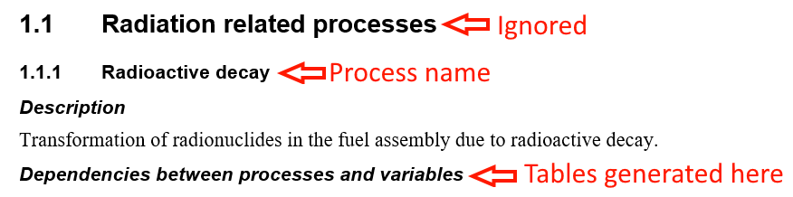

# MSWord-Table-Generator

## File Syncing
Using the syncing GUI

## Table generation
Generating tables can be done using the provided Table Generation GUI. The generation in divided into three steps:
1. Select Excel files
2. Choose generation type
3. Save files
### Step 1 - Select excel files
Select the excel files that contain the raw data. It is important that the excel files contain the `PSAR SFK FEP list` sheet, as well as the corresponding `_INF` sheets for each component.

### Step 2 - Choose generation type
The tables can either be generated in an empty word document, or inserted into an existing report.

**Empty document:** Generating the tables in an empty document will generate tables for _all_ components in the excel files. A directory is created for each excel file, and the tables will be generated in a `tables.docx` file within the directory. An optional template document may be selected, this will copy the styles in the template document and use these for the generated tables.

**Inserting into document:** Inserting the tables into an existing document will parse the headings and only generate tables for those components that are represented in the document. The tables will be generated automatically assuming the structure of the headings are correct: The top level heading must match the process type described in **[TODO]**. All table will be generated under a heading _"Dependencies between processes and variables"_. The level of this heading does not matter, but the parent heading must match the FEP name in the excel files. Other headings are ignored. **NOTE** The FEP name must be an exact match. If the tables are not being generated, try using the sync function to make sure all headings match exactly.

Example of correct heading layout (red text is not a part of the document)

### Step 3 - Save files

When generating tables in an empty document, choose an output directory where the generated documents should be saved. When inserting into an existing document clicking the save button will save the changes in the document that was selected for insertion. 

## Backups
When inserting tables into an existing document, or when syncing files, the program will create backups for each file. The two most recent versions of each file will be saved. The backups also contain a time stamp in the filename, formatted as `<original-file-name><time-stamp>`. The backups are located in the `backups/` folder under the install path, and can also be opened from the GUI with the "Open backups folder" button in the top-right. 