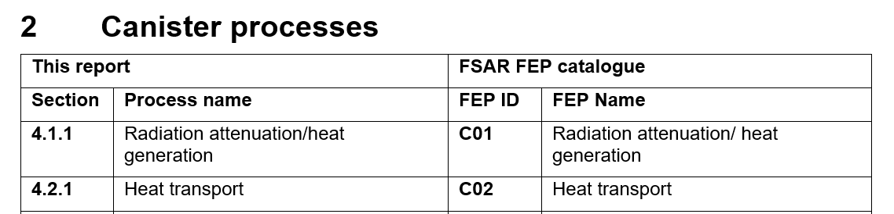

# MSWord-Table-Generator

## File Syncing
The descriptions and mapping tables in word and excel files can be synced using the syncing GUI. This is a two-step process:

1. Select files
2. Resolve mismatches

### Step 1 - Select files
Select one word document and one or more excel files, then click the "sync" button. 

### Step 2 - Resolve Mismatches
For each mismatch a box will appear in the GUI. The mismatch can either be a "Description mismatch" or a "Mapping mismatch". A description mismatch means that the description in the word file does not match the excel description, whereas a mapping mismatch means that the header in the word file does not match the value present in the mapping table. For descriptions there are three options to choose from: Use the description from word, use the description from excel, or skip. Opting to use the word or excel description will overwrite all occurrences with the corresponding description. Choosing "skip" will leave both descriptions unchanged. For mapping mismatches the process is much the same, but the choice is between updating the mapping table to use the word heading, or updating the word heading to match the mapping table.

Once the progress bar reaches 100% all mismatches have been resolved and the files may be saved. This will modify the existing files, but backups will be created beforehand. **Note**: If no boxes appear there may be a mistake in the mapping tables, or some other error may have occurred. Press the button above the progress bar to view an error log.  

## Table generation
Generating tables can be done using the provided Table Generation GUI. The generation in divided into three steps:
1. Select Excel files
2. Choose generation type
3. Save files
### Step 1 - Select excel files
Select the excel files that contain the raw data. It is important that the excel files contain the `PSAR SFK FEP list` sheet, as well as the corresponding `_INF` sheets for each component.

### Step 2 - Choose generation type
The tables can either be generated in an empty word document, or inserted into an existing report.

**Empty document:** Generating the tables in an empty document will generate tables for _all_ components in the excel files. A directory is created for each excel file, and the tables will be generated in a `tables.docx` file within the directory. An optional template document may be selected, this will copy the styles in the template document and use these for the generated tables.

**Inserting into document:** Inserting the tables into an existing document will parse the headings and only generate tables for those components that are represented in the document. The tables will be generated automatically assuming the mapping table exists for the process type. It is important that the mapping table is structured as in the figure below. The program will find a heading in the document matching "Process name" in the table, and generate a table for the corresponding component in the catalogue with the id in the "FEP ID" column.

All table will be generated under a heading _"Dependencies between processes and variables"_. The level of this heading does not matter, but the parent heading must match the Process name described in the mapping table. Other headings are ignored. **NOTE** The FEP name must be an exact match. If the tables are not being generated, try using the sync function to make sure all headings match exactly.

Example of correct mapping table layout

Example of correct heading layout (the red text is not a part of the document)

### Step 3 - Save files

When generating tables in an empty document, choose an output directory where the generated documents should be saved. When inserting into an existing document clicking the save button will save the changes in the document that was selected for insertion. When inserting into a document, the table numbering will not be automatically resolved. To update the numbering in the document select all the text with `ctr+a` and then press `F9`.

## Backups
When inserting tables into an existing document, or when syncing files, the program will create backups for each file. The two most recent versions of each file will be saved. The backups also contain a time stamp in the filename, formatted as `<original-file-name><time-stamp>`. The backups are located in the `backups/` folder under the install path, and can also be opened from the GUI with the "Open backups folder" button in the top-right. 